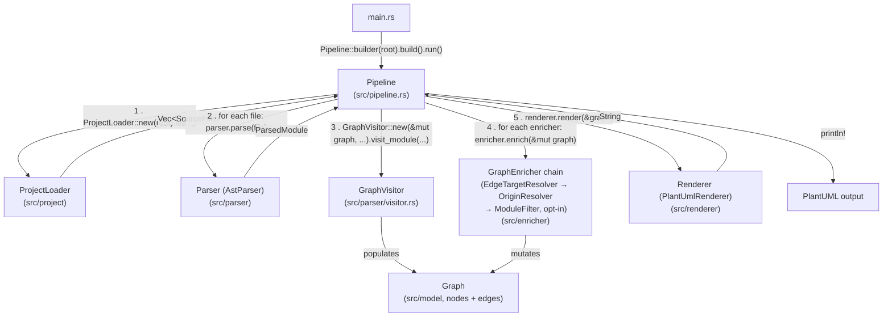

# Architecture

archviz is organized as a **pipeline** of independent stages. Each stage is
defined by a public trait in its own module, with one concrete
implementation provided today. The `Pipeline` struct (`src/pipeline.rs`)
owns one instance of each stage and drives them in sequence; it is the only
piece of code that knows about *all* the modules and wires them together.

`Pipeline::run()` is the single orchestrator: it directly calls every
module below, in order, on every run. No stage calls another stage
directly — `Pipeline` is the only piece of code that knows about all of
them.



Each numbered step is a call `Pipeline::run()` makes itself, in this exact
order:

1. Construct a `ProjectLoader` for the root path and call `.load()` to get
   all `SourceFile`s.
2. For each file, call `self.parser.parse(file)` to get a `ParsedModule`.
3. Construct a `GraphVisitor` over the shared `Graph` and call
   `.visit_module(&parsed)`, which walks the AST and pushes `Node`s/`Edge`s.
4. After *all* files are parsed, call `enricher.enrich(&mut graph)` for
   every enricher in `self.enrichers`, in order.
5. Call `self.renderer.render(&graph)` to produce the final output string.

## Stages

### 1. `ProjectLoader` (`src/project/`)

Walks the target directory (via `walkdir`) and collects every `*.rs` file
into a `SourceFile { path, module_path, source }`. The `module_path` is
derived from the file's path relative to the project root (e.g.
`src/foo/bar.rs` → `["foo", "bar"]`; a `mod.rs` file drops its own trailing
segment), so downstream stages can know which "package" a type belongs to
without re-deriving it from the filesystem.

### 2. `Parser` (`src/parser/`)

The `Parser` trait has one method, `parse(SourceFile) -> ParsedModule`,
implemented by `AstParser` using the [`syn`](https://docs.rs/syn) crate to
turn source text into an AST plus the file's `module_path`.

The parser stage is split into three layers, each with one job:

- **`GraphVisitor` (`src/parser/visitor.rs`)** — thin `syn::Visit`
  adapter. Walks the AST, matches on `syn::ItemStruct` / `ItemTrait` /
  `ItemImpl` / `Field`, converts field types via `extract_type_expr`,
  and forwards each observation to the builder. Does not touch the
  graph directly.
- **`extract_type_expr` (`src/parser/type_extractor.rs`)** — pure
  function `syn::Type → Option<TypeExpr>`. Recursively unwraps
  references, generic arguments, arrays/slices, tuples, and
  `dyn`/`impl Trait` bounds into the parser-internal
  `TypeExpr` IR (`src/parser/type_expr.rs`). Doesn't touch the graph.
- **`GraphBuilder` (`src/parser/graph_builder.rs`)** — knows about
  `Graph`/`Node`/`Edge`, not about `syn`. Exposes a small API
  (`add_struct`, `add_trait`, `add_implements`, `add_field_type`) and
  internally expands compound and trait-wrapper types on the fly:

  - Trait objects (`dyn Trait`, `impl Trait`, `Box<dyn Trait>`, …)
    short-circuit to a direct edge into each underlying trait node —
    no wrapper node is created.
  - Compound types (`Vec<String>`, `[u8]`, `(A, B)`, …) get a
    `NodeKind::Synthetic` node plus `Composition` edges to their inner
    types, recursively.
  - Concrete generics (`Vec<String>`) additionally get a generic-base
    node (`Vec<T>`) and a `Specializes` edge; standard-library bases
    are placed inside the `std` package.

`TypeExpr` is a parser-internal IR and does not leak into the graph —
downstream stages only see plain `Edge { from: String, to: String,
relation }`.

### 3. `GraphEnricher` (`src/enricher/`)

Runs *after* all files have been parsed, so it can see the complete graph.
The `GraphEnricher` trait has one method, `enrich(&self, graph: &mut
Graph)`. One implementation ships by default:

`OriginResolver` (`src/enricher/origin_resolver.rs`) iterates every edge
target and classifies it as `Local` (already a node in the graph), `Std`
(matches a known stdlib / primitive name), or `External`. Targets with no
matching node yet are materialized as synthetic stub nodes placed under
the `std` or `external` package so they appear in the diagram, cleanly
separated from project-local types. The classification is name-based (see
`src/model/origin.rs`); a later revision could delegate to rust-analyzer
for precise resolution.

`Pipeline` supports **multiple** enrichers (`Vec<Box<dyn GraphEnricher>>`),
run in order, so additional enrichment passes (e.g. computing metrics,
filtering, or adding annotations) can be added without touching existing
ones.

`ModuleFilter` (`src/enricher/module_filter.rs`) is an **opt-in**
enricher appended to the chain when the user passes `--include`,
`--exclude`, or `--collapse` on the command line. It runs *after* the
resolvers so every edge target is a resolved [`NodeId`]; it drops nodes
that match `--exclude` (or that don't match `--include`), and collapses
`--collapse` matches into a single synthetic `NodeKind::Package` node
whose incoming edges are redirected to the package. See
`docs/filtering.md` for pattern syntax and worked examples.

### 4. `Renderer` (`src/renderer/`)

`Renderer` is a supertrait of `DrawNode` + `DrawEdge`. Its `render(&self,
graph: &Graph) -> String` method has a default implementation that emits
`preamble()`, then every node via `draw_node`, then every edge via
`draw_edge`, then `postamble()`. Implementors only need to supply
`draw_node`/`draw_edge` (and optionally override `preamble`/`postamble`).

`PlantUmlRenderer` (`src/renderer/plantuml.rs`) is the only implementation
today; it nests `package "..." { ... }` blocks per `module_path` segment
around each node and prints PlantUML `class`/`interface`/`enum`
declarations and relationship arrows.

## Data flow

Data flows strictly **one way** through the pipeline via the shared
`Graph` (`src/model/graph.rs`, just `Vec<Node>` + `Vec<Edge>`):

```
files ─▶ Parser ─▶ Graph (built incrementally per file)
                     │
                     ▼
              GraphEnricher(s) (mutate Graph in place)
                     │
                     ▼
                 Renderer (Graph → String)
```

There is no back-communication between stages — a later stage never
reaches back into an earlier one. This keeps each stage independently
testable and replaceable.

## Wiring: `Pipeline` and `PipelineBuilder`

`main.rs` builds and runs the pipeline in two lines:

```rust
let output = Pipeline::builder(root).build().run()?;
```

`PipelineBuilder::new` supplies the default implementations (`AstParser`,
the `OriginResolver` enricher, `PlantUmlRenderer`). Callers can override
any stage before calling `.build()`:

```rust
Pipeline::builder(root)
    .with_parser(MyParser)
    .with_enricher(MyExtraEnricher)
    .with_renderer(MyRenderer)
    .build()
    .run()?;
```

`Pipeline::run` performs the actual orchestration described above: load
files, parse + visit each one into the `Graph`, run all enrichers, then
render. See `design-patterns.md` for the design patterns behind this
wiring (trait objects, builder pattern, strategy pattern, visitor
pattern).
