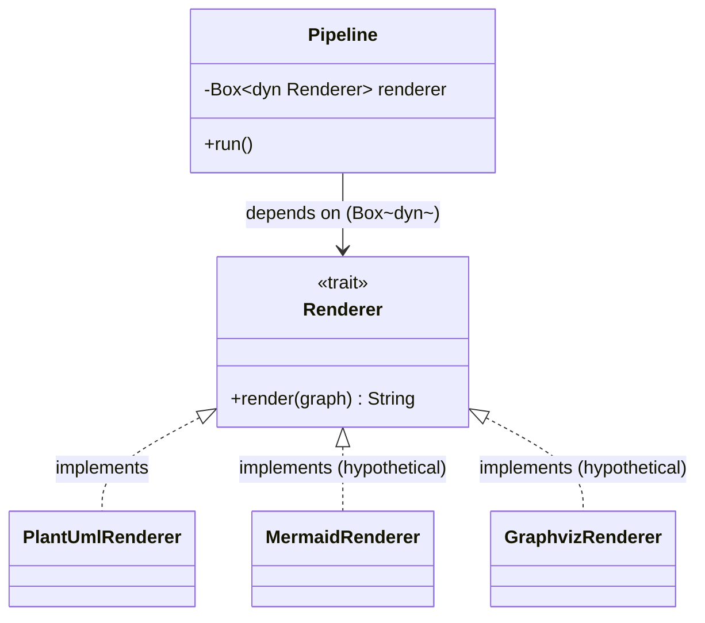
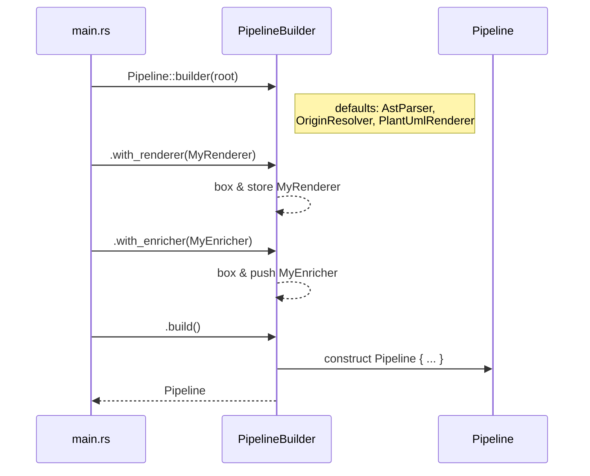
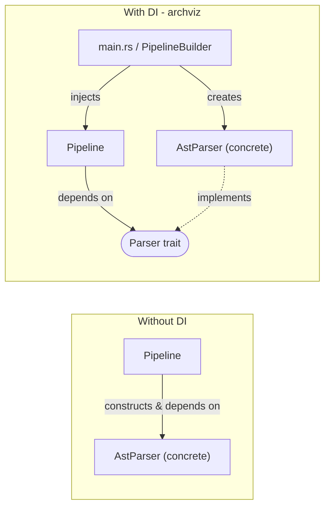
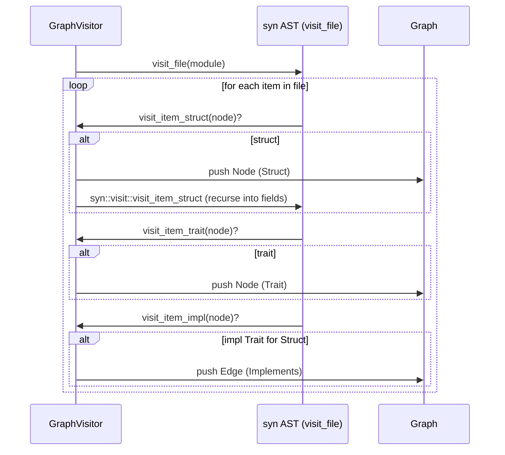
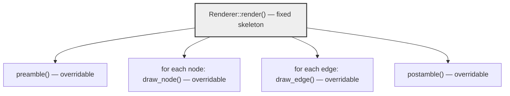
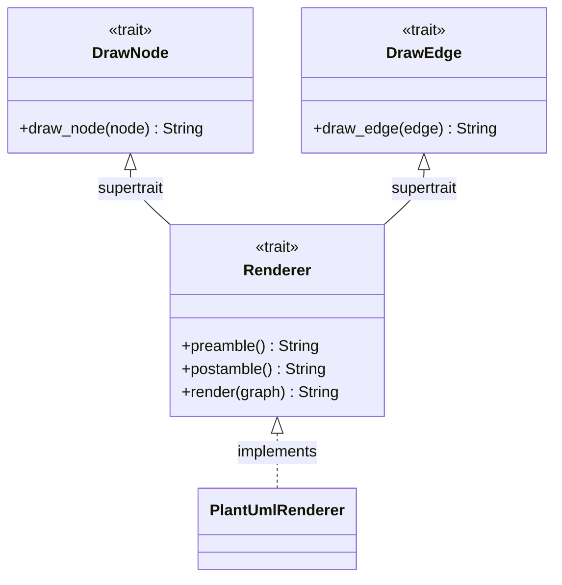

# Design Patterns

This document describes the design patterns used in archviz. Each section
explains the pattern in general terms — so the explanation is reusable as
a reference in other projects — followed by how *this* project applies it.

## 1. Strategy pattern

**General idea:** Extract an algorithm (or a family of interchangeable
algorithms) behind a common interface, so the code that *uses* the
algorithm depends only on the interface, not on any specific
implementation. Concrete strategies can then be swapped, combined, or
extended without changing the calling code. In Rust this is typically
expressed as a trait, with implementations selected either statically
(generics) or dynamically (`Box<dyn Trait>` / `&dyn Trait`) when the
concrete type must be decided at runtime or stored in a heterogeneous
collection.

**In archviz:** Each pipeline stage — parsing, enriching, rendering — is
defined as a small trait describing *what* the stage does, decoupled from
*how*:

```rust
pub trait Parser {
    fn parse(&self, file: SourceFile) -> Result<ParsedModule>;
}

pub trait GraphEnricher {
    fn enrich(&self, graph: &mut Graph);
}

pub trait Renderer: DrawNode + DrawEdge {
    fn render(&self, graph: &Graph) -> String { /* default impl */ }
}
```

`Pipeline` stores each stage behind `Box<dyn Trait>` and never references a
concrete type:

```rust
pub struct Pipeline {
    root: String,
    parser: Box<dyn Parser>,
    enrichers: Vec<Box<dyn GraphEnricher>>,
    filters: Vec<Box<dyn Filter>>,
    renderer: Box<dyn Renderer>,
}
```

Adding a new strategy (e.g. a Mermaid or Graphviz renderer) means writing
`impl Renderer for MyRenderer` — `Pipeline` and the other stages never
change. `enrichers: Vec<Box<dyn GraphEnricher>>` and `filters: Vec<Box<dyn
Filter>>` extend this to *chains* of strategies applied in sequence over
the same data — enrichers *add* information (`EdgeTargetResolver`,
`OriginResolver`), while filters *reshape* it based on user intent
(`ModuleFilter`, opt-in). Each trait lives in its own module and its
implementations never know about each other.

The CLI ↔ filter boundary is a small applied case of **dependency
inversion**: `src/cli.rs` only collects raw pattern strings on
`CliFilter`; `PipelineBuilder::with_filter_options(FilterOptions)` parses
them internally into `ModulePattern`s. Neither `cli` nor `main` imports
anything from `filter::pattern` or `filter::spec` — the CLI can't build
an invalid filter because it can't spell one.



`Pipeline` only ever talks to the `Renderer` box in the middle; any number
of interchangeable implementations can sit behind it.

## 2. Builder pattern

**General idea:** Separate the construction of a complex object (one with
several optional or defaulted fields) from its final representation.
A builder accumulates configuration step by step — typically via a fluent,
chainable API — and produces the fully-formed object only when `build()`
is called. This avoids constructors with long parameter lists and lets
sensible defaults be provided for anything the caller doesn't override.

**In archviz:** `PipelineBuilder` configures a `Pipeline` incrementally,
providing defaults and fluent `with_*` methods:

```rust
impl PipelineBuilder {
    pub fn new(root: impl Into<String>) -> Self { /* defaults: AstParser, OriginResolver, PlantUmlRenderer */ }
    pub fn with_parser(mut self, parser: impl Parser + 'static) -> Self { ... }
    pub fn with_enricher(mut self, enricher: impl GraphEnricher + 'static) -> Self { ... }
    pub fn with_renderer(mut self, renderer: impl Renderer + 'static) -> Self { ... }
    pub fn build(self) -> Pipeline { ... }
}
```

Each `with_*` accepts a concrete, statically-typed `impl Trait + 'static`
and immediately boxes it for storage, so callers write plain types
(`.with_renderer(PlantUmlRenderer)`) while the builder normalizes
everything to the `Box<dyn Trait>` form the strategy pattern above expects.



The fluent chain reads top-to-bottom as configuration, with the fully
assembled `Pipeline` only appearing at the very end.

## 3. Dependency injection / Dependency Inversion Principle

**General idea:** A component should depend on an abstraction (interface),
not on concrete implementations of that abstraction. The concrete
implementation is supplied ("injected") from the outside — by a caller,
factory, or builder — rather than constructed internally by the component
that uses it. This is what makes a component testable (inject a fake/mock)
and extensible (inject a new implementation without modifying the
component).

**In archviz:** `Pipeline` never constructs an `AstParser`, a concrete
enricher, or `PlantUmlRenderer` itself and never names those concrete
types in its own fields — it only knows about the `Parser`,
`GraphEnricher`, and `Renderer` traits. The concrete instances are
supplied by `PipelineBuilder` (and, ultimately, chosen in `main.rs`).
Consequences:

- `Pipeline` can be exercised in tests with fake parsers/enrichers/renderers.
- New back ends (a parser for another language, a new diagram format) can
  be added purely by implementing a trait, without modifying `Pipeline` —
  an instance of the **Open/Closed Principle**.



Without DI, `Pipeline` would hard-code `AstParser` and could never be
tested or extended without editing it. With DI, `Pipeline` only sees the
`Parser` trait; whoever assembles the pipeline (here, `main.rs` via
`PipelineBuilder`) decides which concrete type fills that role.

## 4. Visitor pattern

**General idea:** Separate an operation from the structure of the data it
operates on, so new operations can be added without modifying the data
types. A "visitor" defines a callback per data variant/node type; a
traversal routine walks the structure and calls back into the visitor at
each node, typically falling back to a default traversal for parts the
visitor doesn't care about. This is especially useful for tree-shaped data
like an AST, where many different analyses need to walk the same
structure.

**In archviz:** `GraphVisitor` implements `syn::visit::Visit`, the `syn`
crate's built-in Visitor pattern for walking a Rust AST. It overrides only
the callbacks it needs (`visit_item_struct`, `visit_item_trait`,
`visit_item_impl`, ...), delegating everything else to the default
traversal (e.g. `syn::visit::visit_item_struct(self, node)`), and
accumulates results into a shared `Graph` as a side effect of the walk —
avoiding a hand-written recursive descent over every AST node type.



`GraphVisitor` only reacts to the node kinds it cares about; every other
AST node is still visited by `syn`'s default traversal, just without a
callback firing.

## 5. Template method pattern

**General idea:** Define the fixed skeleton of an algorithm in one place
(often as a default method or base-class method), while deferring the
variable, format- or type-specific steps to overridable methods.
Implementors only need to supply the "hot spots"; the overall control flow
is shared and cannot be accidentally duplicated or gotten wrong.

**In archviz:** `Renderer::render` is a default trait method defining a
fixed rendering algorithm — emit a preamble, draw all nodes, draw all
edges, emit a postamble — while delegating the variable parts to
`draw_node`/`draw_edge` (and optionally `preamble`/`postamble`):

```rust
pub trait Renderer: DrawNode + DrawEdge {
    fn preamble(&self) -> String { String::new() }
    fn postamble(&self) -> String { String::new() }

    fn render(&self, graph: &Graph) -> String {
        let mut out = self.preamble();
        for node in &graph.nodes { out.push_str(&self.draw_node(node)); }
        out.push('\n');
        for edge in &graph.edges { out.push_str(&self.draw_edge(edge)); }
        out.push_str(&self.postamble());
        out
    }
}
```

Any new renderer only implements `DrawNode`/`DrawEdge` (and optionally
overrides `preamble`/`postamble`) — it inherits the correct overall
rendering order for free.



The box order (`preamble → nodes → edges → postamble`) is fixed by the
trait's default method and shared by every renderer; only the contents of
each box vary per implementation.

## 6. Interface segregation (small, focused traits)

**General idea:** Prefer several small, single-purpose interfaces over one
large interface. Clients (and implementors) then depend only on the
methods they actually need, which makes each piece easier to implement,
test, and reuse independently, while larger interfaces can still be
composed from the smaller ones via supertraits/inheritance.

**In archviz:** rendering is split into `DrawNode`, `DrawEdge`, and
`Renderer` (a supertrait of the first two) rather than one large trait.
Node-drawing and edge-drawing logic can be implemented, tested, and
reasoned about independently, while `Renderer` composes them into the
single interface `Pipeline` actually depends on.



`PlantUmlRenderer` implements the two small traits directly; `Renderer`'s
default `render()` composes them, so `Pipeline` can depend on the single
`Renderer` interface without knowing it's built from two smaller pieces.

## Where these patterns are *not* used

Not every type needs a pattern. `ProjectLoader` and the plain data model
(`Graph`, `Node`, `Edge`) are concrete structs/enums with no trait
abstraction — they are simple data holders / a single fixed
implementation with no need for interchangeable strategies. Applying
patterns where there is no variation to abstract over just adds
indirection without benefit.

## Coding convention: prefer `for` loops over iterator chains

**General idea:** Rust's iterator adapters (`.iter().map(...).collect()`,
`.iter().any(...)`, `.iter().filter_map(...).collect()`, …) are expressive
but they also hide the loop body inside a chain of closures. An explicit
`for` loop with a small `mut` accumulator makes the sequence of steps —
"start empty, walk each element, push/insert/decide, return" — visible on
the page, which is easier to step through in a debugger, easier to add
a `println!`/breakpoint to, and easier to extend with an extra branch
without restructuring the whole chain into a fold.

**In archviz:** Whenever a loop-shaped transformation is needed —
building a `Vec`/`HashSet`/`HashMap`, checking whether any element
matches, joining a list of names — write it as a `for` loop over a `mut`
accumulator rather than an `.iter()` / `.into_iter()` chain. For example,
`TypeExpr::type_name()` builds the rendered generic argument list this
way:

```rust
let mut parts: Vec<String> = Vec::new();
for a in args {
    parts.push(a.resolve_refs().type_name());
}
let rendered = parts.join(", ");
```

instead of the equivalent `args.iter().map(...).collect::<Vec<_>>().join(", ")`.
The same convention applies to membership checks (write a `for` loop
with an early `break` rather than `.iter().any(...)`) and to
`filter_map`-style extractions (write a `for` loop with an `if let`
inside rather than `.iter().filter_map(...).collect()`). Iterator methods
on `Path`/`Components` that are only reachable via a method call
(`rel.components()`) are still fine — the point is the loop *body*,
not the source of the iterator.
